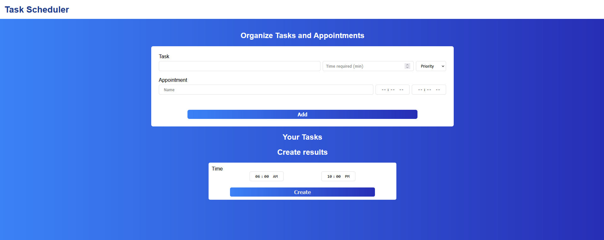

# TaskScheduler
TaskScheduler is a simple program I created to learn TypeScript syntax and get familiar with NodeJs. This is my first time using theses.

📌 Don't expect much from this. It is probably bugged and have a very simple behavior. Note : I'm still open to any suggestions for the code.
# How does it work?
If you launch the app a web server will be created on your http://localhost:3500. You will land on a page like this :

On this page you can enter all the tasks and appointments you have during your day. When all of this is done you enter the start and end of your day and your tasks will be arranged for you automatically.